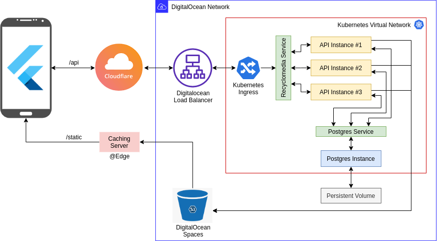

# Recyclomedia


Recyclopedia is a vintage inspired digital platform that aims to save the planet from the pollution which is the major threat to the functioning of earth. Through this platform, **we are creating an energetic community that aims to combat the world from pollution**. The key features of our platform are,

1) The platform allows its users to engage in events related to preventing pollution in the world. Events like beach clean up, community gathering, and workshops are notified under the events section.
2) The users are allowed to donate to our body, to help us host events.
3) A gamification system is incorporated n the system to encourage the participation of the user in our platform. The users will get a tokens of appreciation related to their hierarchy in the levels of contribution.

# System Architecture



# UI Mockups

| Splash Screen | Sign-Up | Sign-In | Home Page |
|:-:|:-:|:-:|:-:|
|  |  |  |  |

| My-Profile | Settings | About-us | Donate to a cause |
|:-:|:-:|:-:|:-:|
|  |  |  |  |

Figma Design files - <https://www.figma.com/file/nSi5UHKdvqL2kS1OrRumID/Recyclomedia>

## Demo


# Backend

Recyclomedia backend is made using django rest framework and backed by postgress database. You can find full API documentation made with postman below. Also Django Rest's API explorer view can be accesed from [recyclomedia.iconicto.com/api](https://recyclomedia.iconicto.com/api).

## Backend Features

- Protected routes
  - Post made by user X can't be modified/deleted by user Y
  - Sepreate web based dashboard for organizations manage events that are hosted by them
        - Event created by organization A can't be modified/deleted by organization B
- Role Based access control
- Static contains are delivered by custom CDN ([cdn.iconicto.com](https://cdn.iconicto.com/))
- End to End TLS
- Horizontal and Vertical scaling (thanks Kubernetes)

### Admin's View vs Org Admins View

#### Dashboard


#### Event Page


## API documentation

[documenter.getpostman.com/view/6342371/T17AkB4T?version=latest](https://documenter.getpostman.com/view/6342371/T17AkB4T?version=latest)

## API Routes

### User

#### Get Users

```http
GET /api/users/ HTTP/1.1
Host: recyclomedia.iconicto.com
```

#### Get User Info

```http
GET /api/users/me/ HTTP/1.1
Host: recyclomedia.iconicto.com
```

#### Create User

```http
POST /api/users/ HTTP/1.1
Host: recyclomedia.iconicto.com
```

#### Update User

```http
PATCH /api/users/ HTTP/1.1
Host: recyclomedia.iconicto.com
```

### Posts

#### Get Posts

```http
GET /api/users/ HTTP/1.1
Host: recyclomedia.iconicto.com
```

#### Create Post

```http
POST /api/posts/ HTTP/1.1
Host: recyclomedia.iconicto.com
```

#### Update Post

```http
PATCH /api/posts/<POSTID>/ HTTP/1.1
Host: recyclomedia.iconicto.com
```

#### Delete Post

```http
DELETE /api/posts/<POSTID>/ HTTP/1.1
Host: recyclomedia.iconicto.com
```

### Events

#### Get Events

```http
GET /api/events/ HTTP/1.1
Host: recyclomedia.iconicto.com
```

### Organizations

#### Get Organizations

```http
GET /api/organizations/ HTTP/1.1
Host: recyclomedia.iconicto.com
```

### Badges

#### Get Badges

```http
GET /api/badges/ HTTP/1.1
Host: recyclomedia.iconicto.com
```

## Team

- [Akassharjun Shanmugarajah](https://www.linkedin.com/in/akassharjun/) (UI/UX, Flutter Developer)
  - @akassharjun
- [Suvin Nimnaka](https://www.linkedin.com/in/suvink/) (UI/UX, Flutter Developer)
  - @Suvink
- [Visal Rajapakse](https://www.linkedin.com/in/visalrajapakse99/) (UI/UX, Flutter Developer)
  - @v15a1
- [Isala Piyaris](https://www.linkedin.com/in/isalapiyarisi/) (Backend / DevOps Engineering)
  - @mrsupiri
- [Thivvyan Karuneswaran](https://www.linkedin.com/in/thivvyankaruneswaran/) (Business Analyst)
  - @thivvyan
